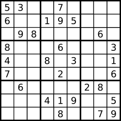

# 题目  有效的数独
判断一个 9x9 的数独是否有效。只需要根据以下规则，验证已经填入的数字是否有效即可。

- 数字 1-9 在每一行只能出现一次。
- 数字 1-9 在每一列只能出现一次。
- 数字 1-9 在每一个以粗实线分隔的 3x3 宫内只能出现一次。



数独部分空格内已填入了数字，空白格用 '.' 表示。

## 案例
示例 1:

输入:
```
[
  ["5","3",".",".","7",".",".",".","."],
  ["6",".",".","1","9","5",".",".","."],
  [".","9","8",".",".",".",".","6","."],
  ["8",".",".",".","6",".",".",".","3"],
  ["4",".",".","8",".","3",".",".","1"],
  ["7",".",".",".","2",".",".",".","6"],
  [".","6",".",".",".",".","2","8","."],
  [".",".",".","4","1","9",".",".","5"],
  [".",".",".",".","8",".",".","7","9"]
]

输出: true
```
示例 2:
```
输入:
[
  ["8","3",".",".","7",".",".",".","."],
  ["6",".",".","1","9","5",".",".","."],
  [".","9","8",".",".",".",".","6","."],
  ["8",".",".",".","6",".",".",".","3"],
  ["4",".",".","8",".","3",".",".","1"],
  ["7",".",".",".","2",".",".",".","6"],
  [".","6",".",".",".",".","2","8","."],
  [".",".",".","4","1","9",".",".","5"],
  [".",".",".",".","8",".",".","7","9"]
]
```
输出: false
解释: 除了第一行的第一个数字从 5 改为 8 以外，空格内其他数字均与 示例1 相同。
     但由于位于左上角的 3x3 宫内有两个 8 存在, 因此这个数独是无效的。
## 说明

- 一个有效的数独（部分已被填充）不一定是可解的。
- 只需要根据以上规则，验证已经填入的数字是否有效即可。
- 给定数独序列只包含数字 1-9 和字符 '.' 。
- 给定数独永远是 9x9 形式的。

# 思路

设置三个标志矩阵，分别记录各行，各列，各小方阵是否出现某个数字，其中行和列标志下标很好对应，就是小方阵的下标需要稍稍转换一下，如下代码；

# 代码

``` c++
class Solution {
public:
    bool isValidSudoku(vector<vector<char>>& board) {
        int n = board.size();
        vector<vector<bool>> iscol(n,vector<bool>(n,false));
        vector<vector<bool>> isrow(n,vector<bool>(n,false));
        vector<vector<bool>> ismini(n,vector<bool>(n,false));
        for(int i = 0; i < n; i++)
        {
            for(int j = 0; j < n; j++)
            {
                if(board[i][j] >= '0' && board[i][j] <= '9')
                {
                    int t = board[i][j] - '1';
                    if(iscol[t][j] || isrow[i][t] || ismini[3 * (i / 3) + j / 3][t])
                        return false;
                    iscol[t][j] = true;
                    isrow[i][t] = true;
                    ismini[3 * (i / 3) + j / 3][t] = true;
                }
            }
        }
        return true; 
    }
};
```

